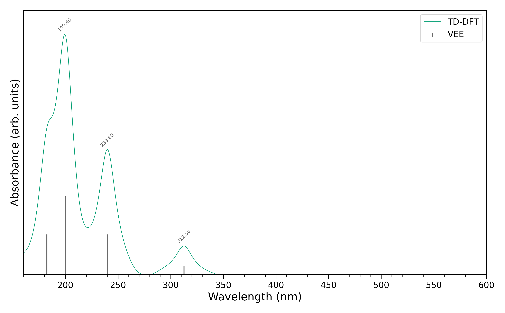
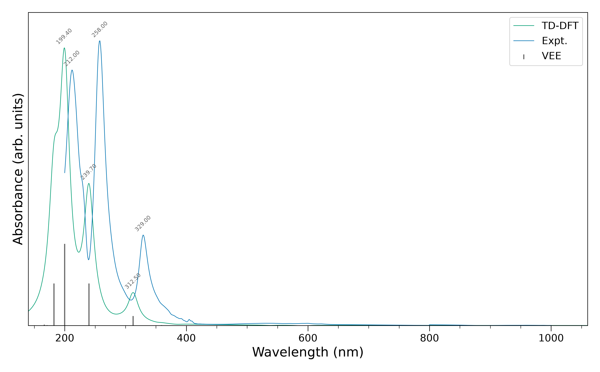
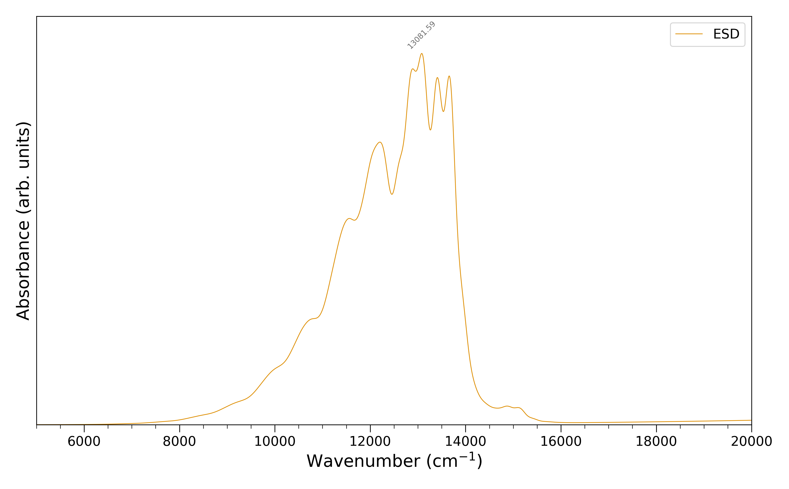
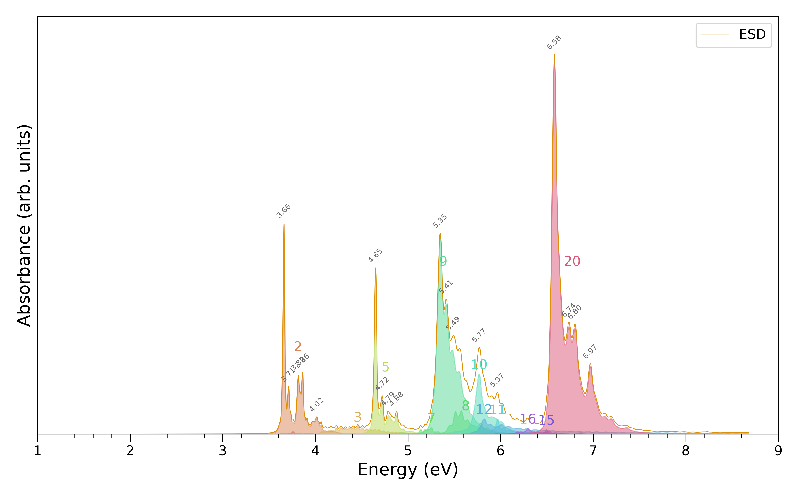
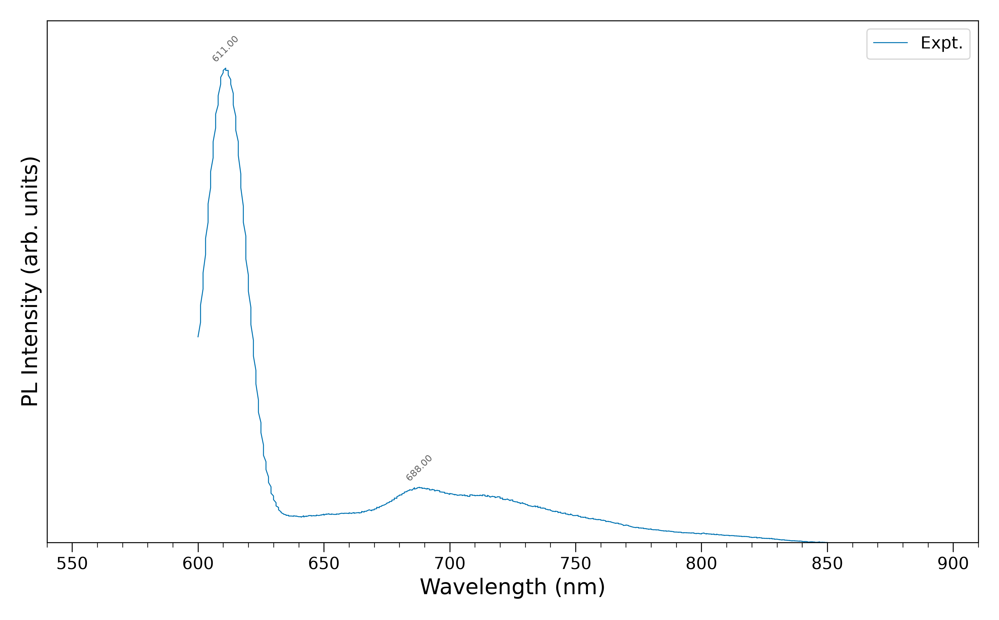
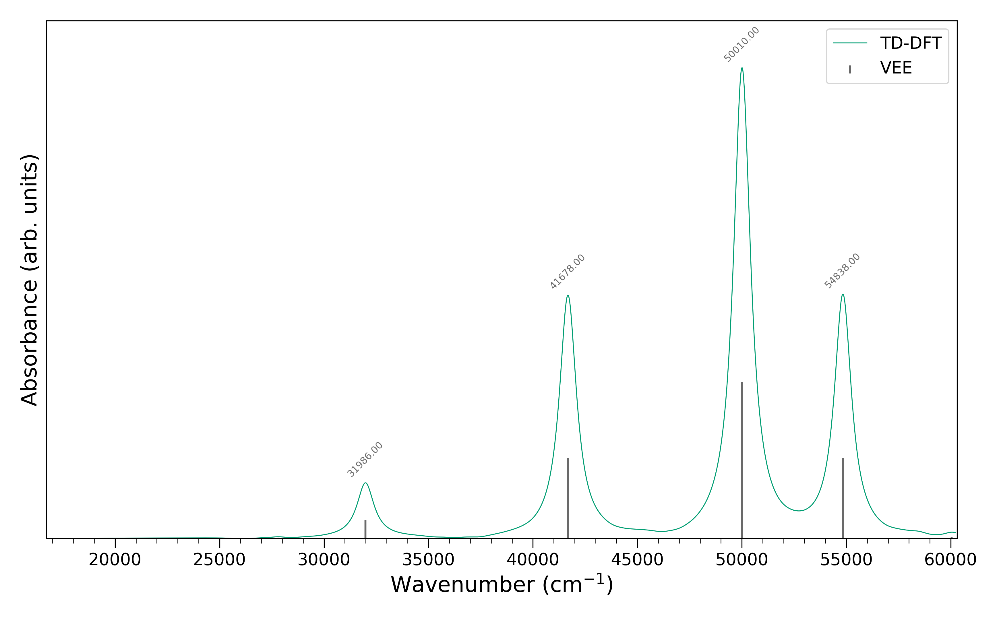
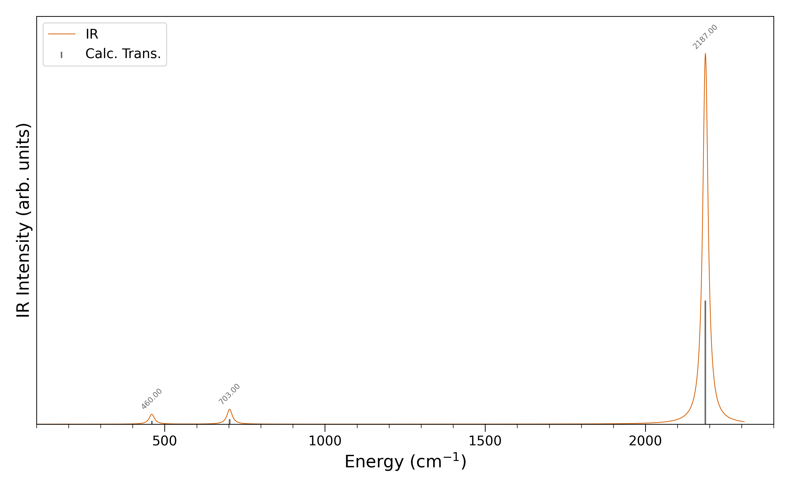
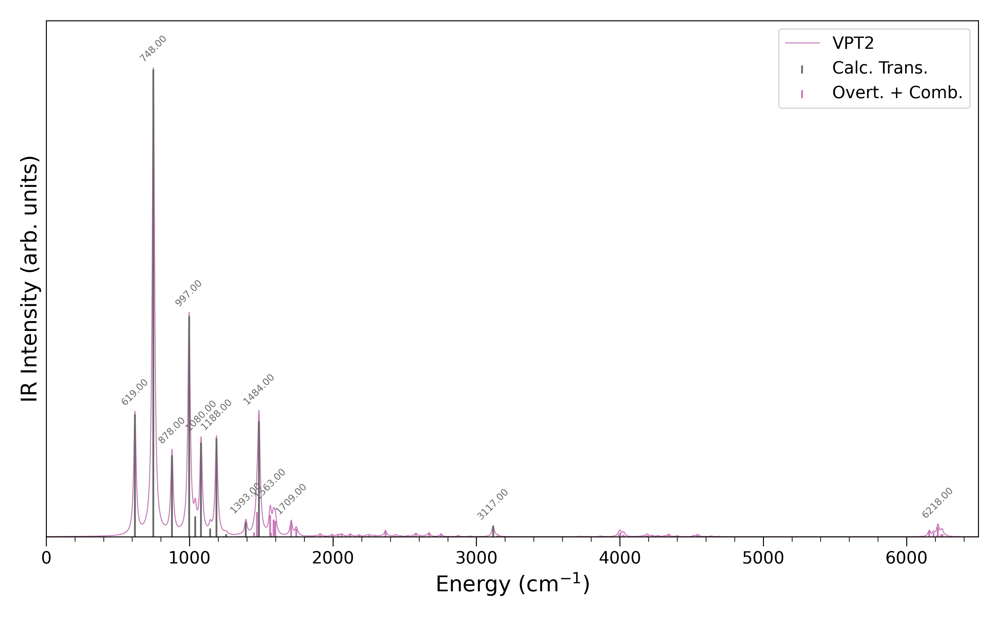
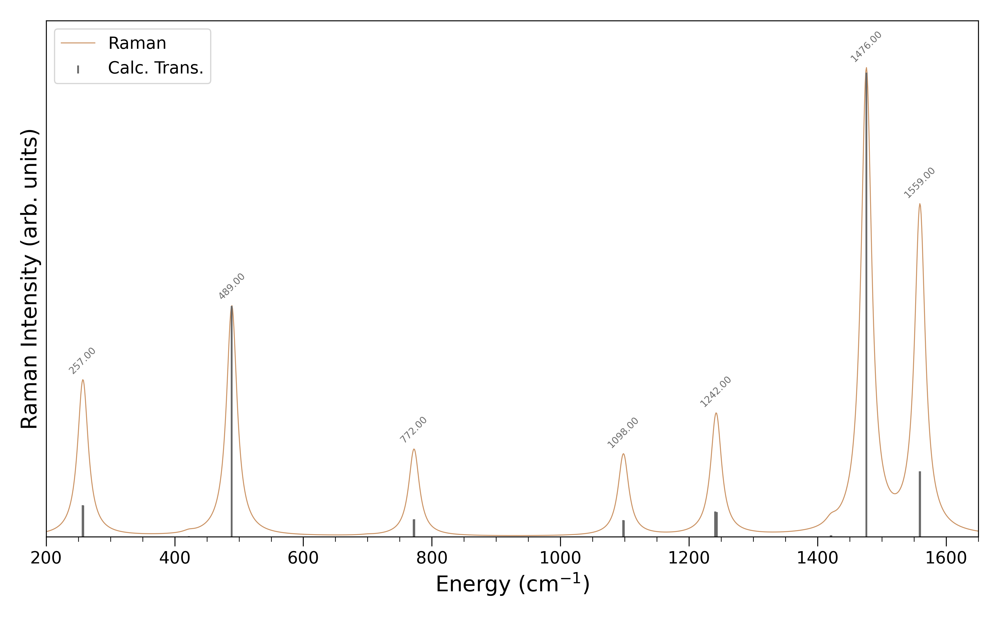

# `spectroplot`

Plot absorption and fluorescence spectra from ORCA output files, experimental data, and much more.

A Python 3 package for plotting optical spectra with peak detection and annotation.
It combines the stick spectrum with the convoluted spectrum (lorentzian or gaussian line shape).
The package supports energy (wave number or electron-volt, cm<sup>-1</sup> or eV) and wavelength (λ, nm) plots.
The full spectrum or parts of the spectrum can be plotted.

Supported data types:
- **TD-DFT** (`.out`): absorption and fluorescence from ORCA time-dependent density functional theory calculations
- **ESD** (`.spectrum`): absorption and fluorescence from ORCA excited state dynamics module
- **ESD roots** (`.spectrum.rootX`): individual root contributions from ESD
- **Experimental** (`.asc`): experimental spectra loaded as wavelength/intensity pairs
- **IR** (`.out`): harmonic IR spectra from ORCA frequency calculations (auto-detected)
- **Raman** (`.out`): Raman spectra from ORCA frequency calculations (auto-detected)
- **VPT2** (`.out`): anharmonic VPT2-corrected IR spectra with overtones and combination bands (auto-detected)

### Install

```console
pip install .
```

### Quick start

```console
spectroplot [OPTION] filename
```

or

```console
python3 -m spectroplot [OPTION] filename
```

It will save the plot as SVG: `spectrum.svg`

### Examples

```console
# TD-DFT absorption in nm
spectroplot data/TD-DFT/UV_c60-Ih.out -s -n
```



```console
# TD-DFT + experimental overlaid
spectroplot data/TD-DFT/UV_c60-Ih.out data/experimental/C60.asc -s -n
```



```console
# ESD fluorescence in nm with Gaussian lineshape
spectroplot data/ESD/FLUOR/lw100/FLUOR_c60-Ih_esd.spectrum -s -n --lineshape_gauss
```



```console
# ESD absorption in eV (all roots, 3-8 eV range)
spectroplot data/ESD/ABS/ABS_pyrene_esd.spectrum.root* -s -n --plotev -x0 3 -x1 8
```



```console
# PL spectrum
spectroplot data/experimental/C60_PL.asc -s -n -PL
```



```console
# Custom output as PNG
spectroplot data/TD-DFT/UV_c60-Ih.out -o spectrum.png
```



```console
# Harmonic IR spectrum
spectroplot data/IR/FRQ_tungsten_hexacarbonyl_f.out -s -n
```



```console
# VPT2 anharmonic IR spectrum with overtones and combination bands
spectroplot data/VPT2/VPT2_furan_vpt2.out -s -n -x0 0 -x1 6500
```



```console
# Raman spectrum
spectroplot data/Raman/RAM_c60-Ih_r.out -s -n -x0 200 -x1 1650
```



### Command-line options

- `filename` , required: filename (.out, .asc, .spectrum, .spectrum.rootX)
- `-s` , optional: shows the `matplotlib` window
- `-n` , optional: do not save the spectrum
- `-acs` , optional: format the plot to ACS publications standard format
- `-o` `str` , optional: output filename (`.svg` default, supports `.png`/`.pdf`)
- `-pnm` , optional: plot the wavelength (λ, nm) spectrum
- `-pwn` , optional: plot the wave number (energy, cm<sup>-1</sup>) spectrum (default)
- `-pev` , optional: plot the electron-volt (energy, eV) spectrum
- `-lsg` , optional: use the gaussian line shape function (default is lorentzian line shape)
- `-PL` , optional: use the PL Intensity y-axis label (default is Absorbance)
- `-wnm` `N` , optional: line width of the line shape for the nm scale (default is `N = 20`)
- `-wwn` `N` , optional: line width of the line shape for the cm<sup>-1</sup> scale (default is `N = 1000`)
- `-wev` `N` , optional: line width of the line shape for the eV scale (default is `N = 0.1`)
- `-x0`  `N` , optional: start spectrum at N nm or N cm<sup>-1</sup> (`x0 => 0`)
- `-x1`  `N` , optional: end spectrum at N nm or N cm<sup>-1</sup> (`x1 => 0`)
- `-y1`  `N` , optional: end statically spectrum at N arb. units (`y1 => 0`)
- `-swn` `N` , optional: shift the spectrum by N cm<sup>-1</sup> (default is `N = 0`)
- `-sev` `N` , optional: shift the spectrum by N eV (default is `N = 0`)

### Script options

There are numerous ways to configure the spectrum.
Check `# plot config section - configure here` in `src/spectroplot/global_constants.py`.
You can even configure the script to plot of the single line shape functions.

### Remarks

The SVG file will be replaced every time you run the script with the same output name. 
For TD-DFT data, the absorption spectrum is taken from the section 
"ABSORPTION SPECTRUM VIA TRANSITION ELECTRIC DIPOLE MOMENTS" in the ORCA output.

## Requirements

- `numpy`
- `pandas`
- `matplotlib`
- `seaborn`
- `scipy`

## Contributor

Contributed by Emmanuel Bourret

Based on `orca_uv` by [Sebastian Dechert](https://github.com/radi0sus/orca_uv)

## TO DO

### Planned features
- Change the line color/style when the same type of data type is plotted multiple times.
- Add transmittance mode (-tr/--transmittance) for IR/Raman/VPT2 spectra.

### Naming / docs
- N1: Fix misleading comment about peak detection requiring x-start at 0
- N2: Rename show_plots (returns True=skip, opposite of what name suggests)
- N3: Rename a_label to label_rotation_angle
- N4: Remove commented-out x_label_nm dead code

### Performance
- P1: read_out() reads entire file at once instead of line-by-line
- P2: No early exit in read_ir/read_raman after IR/Raman section ends
- P3: Python list comparison in hot loop; use np.array_equal

### Imports / structure
- I1: Logger in data_reader.py is unconfigured
- I2: Logger placed between import groups
- I3: Misleading shebang on non-executable module

### Test coverage
- T1: No unit test for show_plots()
- T2: No unit test for is_unique()
- T3: No unit test for rootSum()
- T4: No unit tests for xdataPrep, xdatamin, xdatamax, plotxrange
- T5: read_ir, read_raman, read_vpt2 not tested in isolation
- T6: read_out_abs only exercises one ORCA version path
- T7: No tests for show_* toggle combinations
- T8: test_nonexistent_file_skipped doesn't check exit code
- T9-T10: Use pytest.raises instead of try/except/else

### Minor
- M1: ORCA version check uses first char only (wrong for 10+)
- M2: Hardcoded mode + 6 magic number in VPT2
- M3: Hardcoded skip offsets +4/+5 in VPT2 parsing
- M4: Fragile for...else: continue; break pattern
- M5: Docstring says "strings" but works on any type
- M6: Mutable module-level constants
- M7: Unused loop variable i
- M8: normalization returns NaN for constant input (division by zero)
- M9: roundup/rounddown silently return x when no unit flag set
- M10: read_name doesn't read, just parses path
- M11: No version pins in pyproject.toml
- M12: npt_wn=1 may produce jagged peaks for sharp lines
